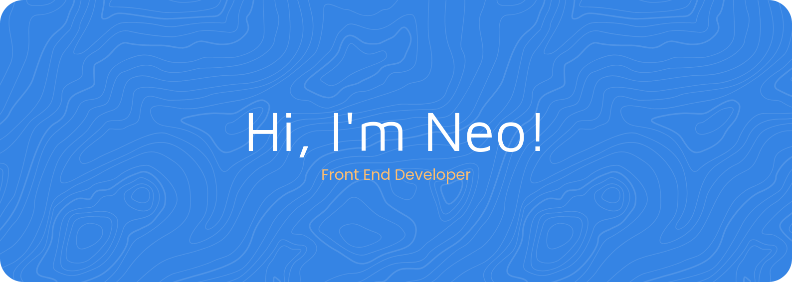

I'm a Spanish front end developer based in Sweden.

I design and build websites with an emphasis on playfulness and accessibility. 

If I get an idea, I'll make sure to build it and polish it to perfection.

I'm currently learning on my own by building [my own personal website](https://neo-citrus-web.neocities.org) and I'm starting a new web app project really soon!

You can reach me here or through my email!

🍊 Fun facts about me: 

- I love console restoration and have fixed/modded some of my own comsoles.
- My favorite Pókemon are Chandelure, Maushold and Leafeon.
- **Hobbies:** drawing, playing games, collecting Pókemon cards.

 
